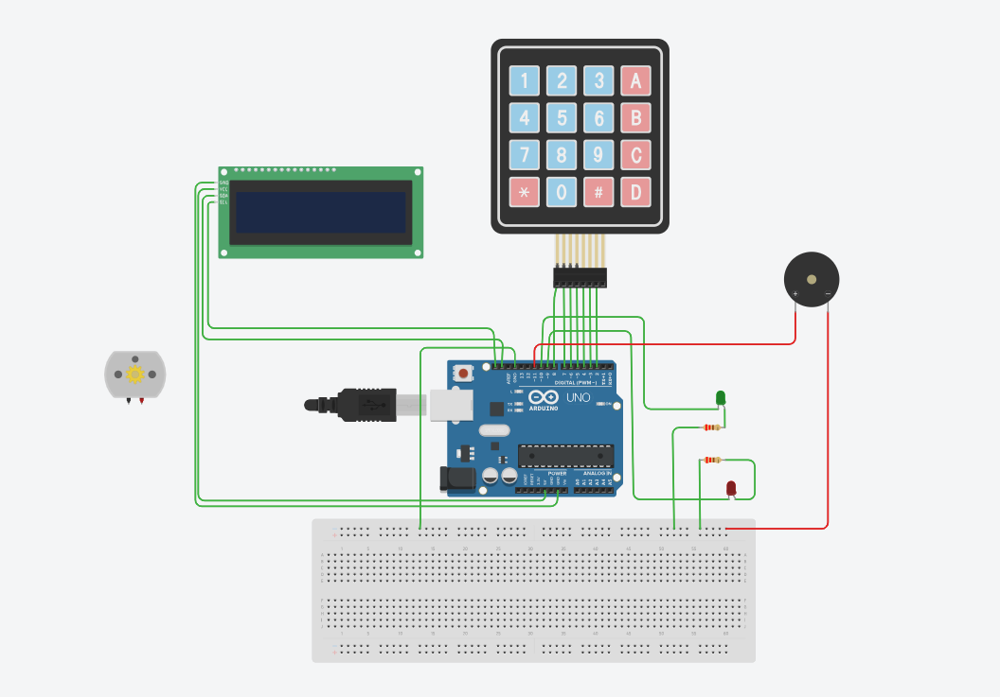

<h1 align="center">🔐 Arduino Kasa Kilidi Projesi</h1>

  
  
  
  

  Bu proje, <b>Arduino</b> kullanılarak yapılmış bir <b>şifreli kasa kilidi sistemidir</b>. 
  Kullanıcı 4 haneli bir şifre girerek sistemi açabilir.  
  Doğru veya yanlış girişlerde <b>LED</b>, <b>buzzer</b> ve <b>LCD ekran</b> ile geri bildirim verilir.  
  Ayrıca doğru şifre girildiğinde <b>servo motor</b> kasayı açar. 

---

## 🧠 Özellikler
- Kullanıcı 4 haneli şifreyi girer.  
- `#` tuşuna basıldığında şifre kontrol edilir.  
- **Doğru şifre:**
  - ✅ Yeşil LED yanar  
  - ✅ Servo motor kilidi açar  
  - ✅ Buzzer kısa sinyal verir  
- **Yanlış şifre:**
  - ❌ Kırmızı LED yanar  
  - ❌ Buzzer uzun sinyal verir  
- LCD ekranda şifre girişi ve sonuç gösterilir  

---

## ⚙️ Kullanılan Donanımlar
- 🔸 Arduino Uno  
- 🔸 4x3 Tuş Takımı (Keypad)  
- 🔸 LCD Ekran (I2C 20x4)  
- 🔸 Servo Motor  
- 🔸 Buzzer  
- 🔸 LED (Kırmızı ve Yeşil)  
- 🔸 Dirençler ve jumper kablolar  

---

## 🔌 Bağlantılar

| Bileşen | Arduino Pin |
|----------|--------------|
| Servo Motor | 12 |
| Kırmızı LED | 9 |
| Yeşil LED | 10 |
| Buzzer | 11 |
| Keypad Satır Pinleri | 5, 6, 7, 8 |
| Keypad Sütun Pinleri | 2, 3, 4 |
| LCD (I2C) | 0x27 |

---

## 🔒 Şifre Bilgisi
> Varsayılan şifre: **5807**

---

## 🧰 Kurulum
1. Donanım bağlantılarını yukarıdaki tabloya göre yap.  
2. Arduino IDE'de kodu yükle.  
3. LCD ekranda **“Şifrenizi Giriniz”** mesajı belirecek.  
4. Tuş takımından şifreyi girip `#` tuşuna bas.  

---

## 🧩 Örnek Çalışma
- ✅ **Doğru şifre:** Yeşil LED yanar, servo 90° açılır, buzzer kısa sinyal verir.  
- ❌ **Yanlış şifre:** Kırmızı LED yanar, buzzer uzun sinyal verir.  

---

## 🖼️ Devre Görseli

  

---

## 📜 Lisans
Bu proje açık kaynaklıdır.  
Dilersen geliştirip kendi sistemlerinde kullanabilir veya geliştirme yapabilirsin.  

---

<h3 align="center">👨‍💻 Geliştirici</h3>

  <b>Yavuz ÇANDIR</b>  
   
  

