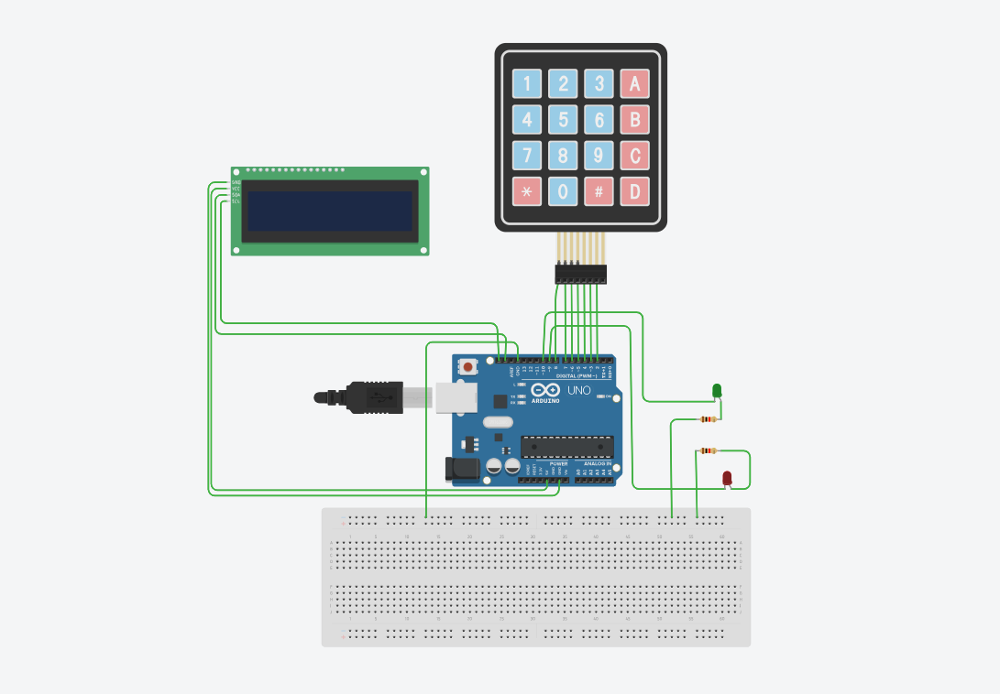

# 🔐 Arduino Kasa Kilidi Projesi

Bu proje, **Arduino** kullanılarak yapılmış bir **şifreli kasa kilidi sistemidir**.  
Kullanıcı 4 haneli bir şifre girerek sistemi açabilir.  
Doğru veya yanlış girişlerde **LED**, **buzzer** ve **LCD ekran** aracılığıyla geri bildirim verilir.  
Ayrıca doğru şifre girildiğinde **servo motor** kasayı açar.  

---

## 🧠 Özellikler
- Kullanıcı 4 haneli şifreyi girer.  
- `#` tuşuna basıldığında şifre kontrol edilir.  
- **Doğru şifre:**
  - Yeşil LED yanar  
  - Servo motor kilidi açar  
  - Buzzer kısa sinyal verir  
- **Yanlış şifre:**
  - Kırmızı LED yanar  
  - Buzzer uzun sinyal verir  
- LCD ekranda şifre girişi ve sonuç görüntülenir  

---

## ⚙️ Kullanılan Donanımlar
- Arduino Uno  
- 4x3 Tuş Takımı (Keypad)  
- LCD Ekran (I2C 20x4)  
- Servo Motor  
- Buzzer  
- LED (Kırmızı ve Yeşil)  
- Dirençler ve jumper kablolar  

---

## 🔌 Bağlantılar
| Bileşen | Arduino Pin |
|----------|--------------|
| Servo Motor | 12 |
| Kırmızı LED | 9 |
| Yeşil LED | 10 |
| Buzzer | 11 |
| Keypad Satır Pinleri | 5, 6, 7, 8 |
| Keypad Sütun Pinleri | 2, 3, 4 |
| LCD (I2C) | 0x27 |

---

## 🔒 Şifre Bilgisi
> Varsayılan şifre: **5807**

---

## 🧰 Kurulum
1. Donanım bağlantılarını yukarıdaki tabloya göre yap.  
2. Arduino IDE'de kodu yükle.  
3. LCD ekranda **“Şifrenizi Giriniz”** mesajı belirecek.  
4. Tuş takımından şifreyi girip `#` tuşuna bas.  

---

## 🧩 Örnek Çalışma
- ✅ **Doğru şifre:** Yeşil LED yanar, servo 90° açılır, buzzer kısa sinyal verir.  
- ❌ **Yanlış şifre:** Kırmızı LED yanar, buzzer uzun sinyal verir.  

---

## 🖼️ Devre Görseli

  

---

## 📜 Lisans
Bu proje açık kaynaklıdır. Dilersen geliştirip kendi sistemlerinde kullanabilirsin.  

---

👨‍💻 **Hazırlayan:** [Yavuz Candır](https://github.com/YavuzCandirr)
